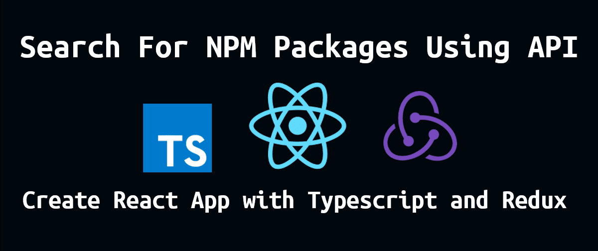
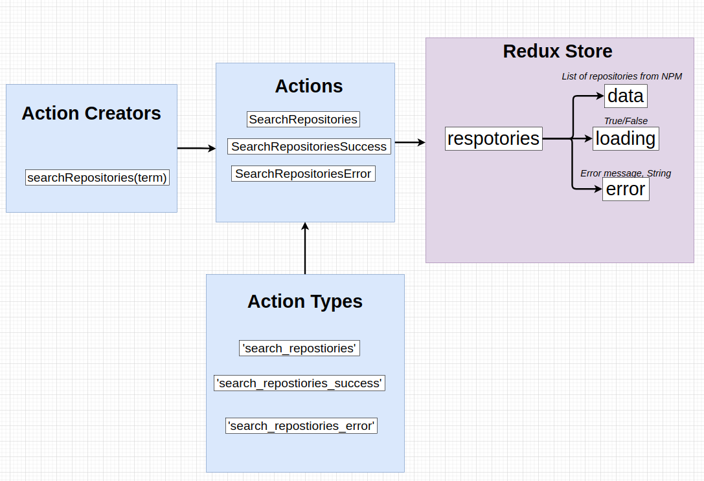
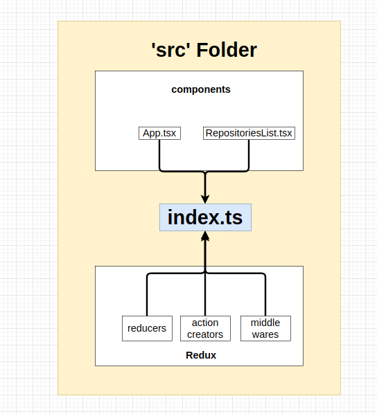

<!-- [![MIT License][license-shield]][license-url] -->

[![LinkedIn][linkedin-shield]](https://www.linkedin.com/in/utoker/)

<!-- PROJECT LOGO -->
 

  

<h3 align="center">Search For Node Packages </h3>
     
    <a href="https://github.com/utoker/search-npm/tree/main/src"><strong>Explore the docs »</strong></a>
     
     
    <a href="https://search-npm.vercel.app/">View Demo</a>

## About The Project

A web app for searching node packages with the implementation of [npms.io](https://npms.io/) API for the TypeScript programming environment. More information about npms.io and its API can be found at their [GitHub](https://github.com/npms-io) repository.

I did this project to implement React-Redux in a TypeScript environment and use it as a boilerplate for my following projects.
 
 

I created a single entry point for reducers, action creators, and middlewares to make a communication point from Redux side to the outside world.

 
 

_I called NPM packages "repositories" because the "package" is a reserved keyword in TypeScript._

<!-- [![Product Name Screen Shot][product-screenshot]](https://example.com)-->

(<a href="#top">back to top</a>)

<!-- GETTING STARTED -->

## Usage

Simple use the text input bar to search the NPM packages you want.

(<a href="#top">back to top</a>)

### Built With

- [React.js](https://reactjs.org/)
- [Redux.js](https://redux.js.org/)
- [TypeScript](https://www.typescriptlang.org/)
- [Axios](https://axios-http.com/)

(<a href="#top">back to top</a>)

## Contact

Umut Toker - utoker@gmail.com

LinkedIn: [https://www.linkedin.com/in/utoker/](https://www.linkedin.com/in/utoker/)

Project Link: [https://github.com/utoker/search-npm](https://github.com/utoker/search-npm)

(<a href="#top">back to top</a>)

<!-- MARKDOWN LINKS & IMAGES -->
<!-- https://www.markdownguide.org/basic-syntax/#reference-style-links -->

[linkedin-shield]: https://img.shields.io/badge/-LinkedIn-black.svg?style=for-the-badge&logo=linkedin&colorB=555
[linkedin-url]: https://linkedin.com/in/linkedin_username
[product-screenshot]: images/screenshot.png
